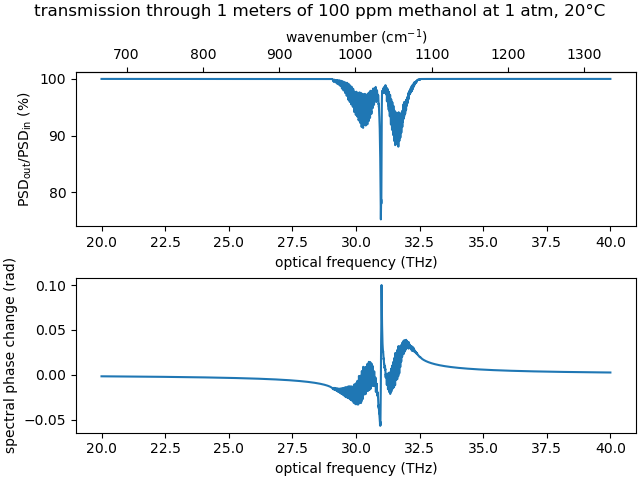

Allows to synthesize complex-valued absorption spectra (i.e., intensity and phase) from the hitran database for different pressures/temperatures accounting for pressure and Doppler broadening, using HAPI. List of supported molecules: <https://hitran.org/lbl/>.

Uses JAX for acceleration if it is installed. Keep in mind that if you use a GPU, single precision is the default. Switching to double precision is recommended (`import jax; jax.config.update("jax_enable_x64", True)` at the beginning of your script, or set the environement variable `JAX_ENABLE_X64=True`). The JAX functions for the complex Voigt profiles were taken from the [https://github.com/HajimeKawahara/exojax](exojax) library.


Installation
------------

In case you are using Windows: Previous to executing the commands below, install Anaconda, open Anaconda prompt and run `conda install git`. Then execute the commands below also from Anaconda prompt.

Use pip to install this package:

```bash
pip uninstall hitran-api
pip install git+https://gitlab.com/leberwurscht/hitran_syn.git
pip install joblib
```

The first line will uninstall the official version of `hitran-api` (HAPI), because `hitran_syn` needs a custom version of it (see <https://github.com/hitranonline/hapi/pull/49>). The second line will install `hitran_syn` with its dependencies (also the custom version of HAPI). The third line will install joblib, which is needed to run the example below.

Example
-------

```python
import numpy as np
import matplotlib.pyplot as plt

import joblib # pip install joblib
memory = joblib.Memory("cache")

import hitran_syn # pip install git+https://gitlab.com/leberwurscht/hitran_syn.git

### list available molecules from HITRAN
print("available molecules:")
for i in hitran_syn.available_molecules:
  print("\t", i)
print()

### compute propagation coefficient
@memory.cache # takes some time (~1 min on my computer), so cache the result with joblib.Memory
def get_data(nu_min, nu_max):
  nu = np.linspace(nu_min,nu_max,25000)

  pressure = 101325 # 1 atm in Torr
  temperature = 273.15+20 # 20°C in Kelvin
  fraction = 100e-6 # 100 ppm
  molecule_name = "(12C)H3(16O)H" # ... of methanol

  gamma = hitran_syn.propagation_coefficient(molecule_name,nu,total_pressure=pressure,partial_pressure=fraction*pressure,temperature=temperature)

  return nu, gamma

### plot
nu, gamma = get_data(20e12, 40e12)
sample_length = 1 # in meters
transmission_coefficient = np.exp(-gamma*sample_length)

fig = plt.figure(constrained_layout=True)
gs = fig.add_gridspec(2,1)
ax = fig.add_subplot(gs[0,0])
ax.plot(nu/1e12, abs(transmission_coefficient)**2 /  1e-2)
ax.set_xlabel("optical frequency (THz)")
ax.set_ylabel(r"PSD$_\mathrm{out}$/PSD$_\mathrm{in}$ (%)")
ax = fig.add_subplot(gs[1,0])
ax.plot(nu/1e12, np.angle(transmission_coefficient))
ax.set_xlabel("optical frequency (THz)")
ax.set_ylabel("spectral phase change (rad)")

fig.suptitle("transmission through {} meters of 100 ppm methanol at 1 atm, 20°C".format(sample_length))
plt.savefig("output.png")
plt.show()
```


